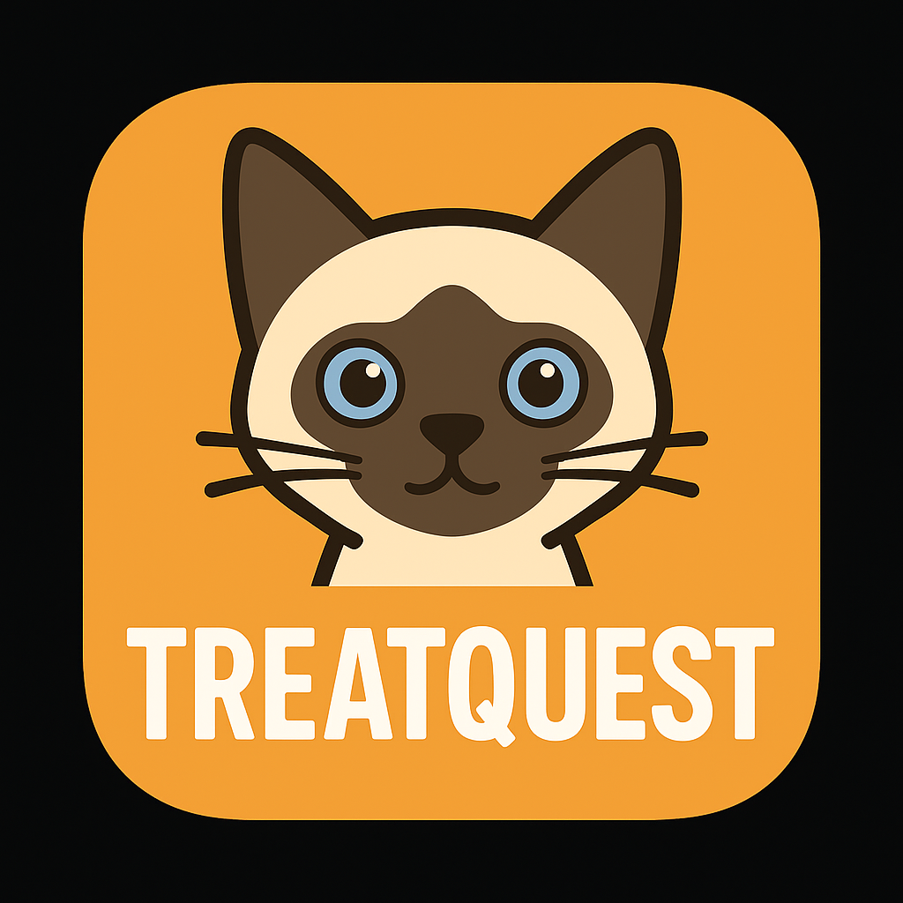

# TreatQuest

TreatQuest is a playful reinforcement learning challenge where you teach a virtual pet to navigate through multiple levels and collect treats while avoiding “traps” in a 2D grid. The pet starts clueless, wandering around, but through trial-and-error and Q Learning it learns which moves bring rewards and which don’t (an optimal policy). By the end, you’ll have a smart companion that finds the fastest route to snacks!

## Project Structure
```
TreatQuest/
│
├── agent/
│ ├── __init__.py # Package initializer
│ └── qagent.py # Q-learning agent implementation
│
├── assets/
│ ├── menu_bg/ # Menu background images
│ ├── pets/ # Pet sprites and animations
│ ├── sounds/ # Sound effects + background music
│ └── tiles/ # Grid tiles and animated tiles
│
├── env/
│ ├── __pycache__/ # Python cache
│ ├── gridworld_env.py # Environment logic (movement, rewards, updates)
│ ├── q_table.py # Q-table utilities
│ └── levels/
│ ├── level1.txt # Base level layout
│ ├── level2.txt # Base level layout
│ ├── level3.txt # Base level layout
│ ├── level4.txt # Base level layout
│ ├── levelAssets.py # Level asset loader
│ ├── temp_level1.txt # Runtime mutable level copy
│ ├── temp_level2.txt # Runtime mutable level copy
│ ├── temp_level3.txt # Runtime mutable level copy
│ └── temp_level4.txt # Runtime mutable level copy
│
├── Screenshots/ # Saved screenshots / visuals
│
├── demo.py # Demo script for quick environment preview
├── main.py # (Optional) main launcher for UI/menu
├── q_action.py # Main entry for training & visual run
├── q_table_level0.npy # Saved Q-table for level 0
├── q_table_level1.npy # Saved Q-table for level 1
├── q_table_level2.npy # Saved Q-table for level 2
├── q_table_level3.npy # Saved Q-table for level 3
├── README.md # Project documentation
├── test_venv.py # Testing environment setup
└── train.py # Training script (non-level-based)
```
# How It Works
    Reinforcement Learning
    TreatQuest uses Q-Learning, a value-based reinforcement learning method, where the agent learns:
        Q(s, a) = expected long-term reward for taking action a in state s
        Through exploration, trial-and-error, and repeated episodes, the agent learns:
        Which tiles give high reward (treats )
        Which tiles to avoid (traps ☠️)
        How to reach the finish efficiently (optimal path)
        How to adjust after the environment changes (treats disappear after eating)

The game includes multiple levels with increasing complexity.
# Installation Dependencies
    Please ensure you install the following packages/libraries:
        numpy (pip install numpy)
        pygame (pip install pygame)

# Training and Running Commands(anything in brackets for MacOS)
    To train the cat: python(3) q_action.py; then select either train by completion or train by a particular episode/level(episodes can be changed in the q_action.py file in the def main() function)
    To run the cat to observe how it collects all treats without hitting any traps: python(3) q_action.py; then select run visual mode (NOTE: ONLY RUN THE CAT WHEN YOU ARE SURE IT HAS BEEN TRAINED TO AVOID UNINTENDED BEHAVIOUR)

# Video Description:
    In the link there is a short video description of our project: https://youtu.be/CPQcyawK4_c

# Contributing
    Pull requests are welcome! For major changes, please open an issue first.


